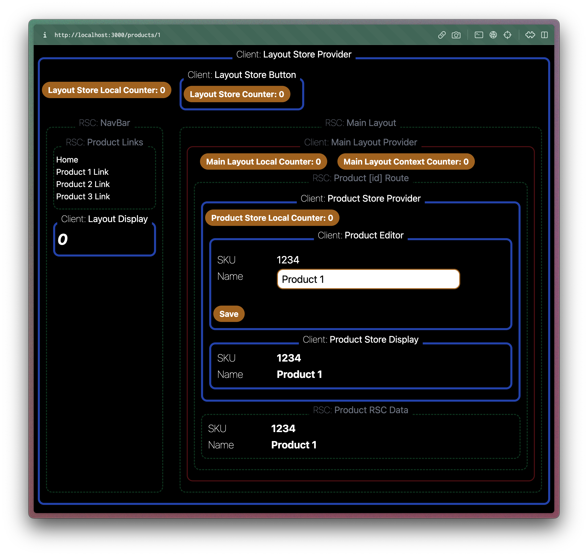

# App Router / State Manager test bed

This application has a home route and a set of product routes. Each product is editable using a client side state manager.

The current state manager is [Zustand](https://zustand-demo.pmnd.rs/).

Shown below is the product page:



- Areas with a **thick blue** border are the state managed areas. These are the areas we are testing.
- Areas with a **dotted green** border are React Server Components (RSCs).
- And areas with a **thin red** bodrder are Client Components that are not state managed.

This test application is designed to test the integration of the state manager into the App Router application.

There are two key areas where we want to use a state manager. In the layout and in a route. The layout state manager would be useful for things like a cart count, or a theme selector. In this case we are using it to manage a simple counter. The layout state manager integration should handle the following:

- The state should be retained across soft route changes.
- The state should not be effected by unrelated state changes.

The route state manager manages state for the page on a per route basis. In this case, the product editor and display. The key requirements for a route based state manager are:

- The state is properly initialized and rendered during SSR.
- The state is properly initialized when a soft route change occurs.
- The state is retained when unrelated state is changed in the tree.
- The state is properly updated when a mutation happens on the server.
- None of this should be effected by suspense or streaming.

## Tentpole Assumptions

- The state manager will not be global since we want to ensure that the state manager isn't polluting data between routes and requests.
- The state manager will not be used in RSCs.

## State Manager Tests

Along with the application is a set of [Playwright Tests](https://playwright.dev) that stress test the integration between the RSCs and the State Manager. The tests are located in the `tests` folder and can be run using the following command:

```bash
pnpm test
```

These playwright tests check to ensure that the integration of the state manager follow all of the criteria listed above.

## Getting Started

First, run the development server:

```bash
pnpm i
pnpm dev
```

Then open [http://localhost:3000](http://localhost:3000) with your browser to see the app.

And run the tests with:

```bash
pnpm test
```

You can also do:

```bash
npx playwright test --ui
```

If you want the GUI for Playwright.

## Testing A Different State Manager or State Manager Integration Style

To test a different state manager or state manager integration style, you can change the implementation of the components in `app/_layoutStoreComponents` and `app/_productStoreComponents`. The layout store components are used in the top level layout and they contain a simple counter. This counter value should be retained between route changes, but is not persisted so it won't survive a hard refresh.

The product store components manage the editor/display state of the current product on the products route (`/products/:id`). The requirements are:

- The product editor and display should be SSR'ed with the initial state of the product for that route.
- The product editor and display should not be changed when any other state on the page is changed.
- The product editor and display should be updated when the page route is soft (or hard) changed to a different product.
